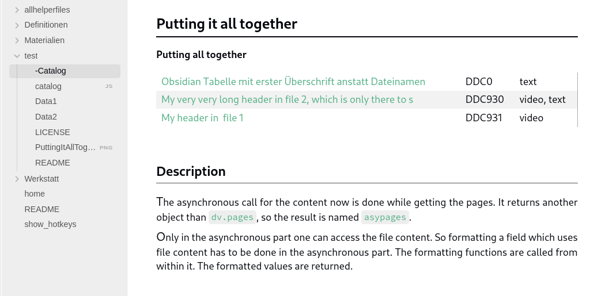

# datajstable
Using Dataviewjs create a table in Obsidian, which uses file contents. Show how to use async function calls in dv.table.

File [-Catalog.md](-Catalog.md) contains the dataviewjs code and explanation. Does only work in  Obsidian.

## Obsidian Tabelle mit erster Überschrift anstatt Dateinamen

## Der Code dafür
```
const len = 60;
const eval_foldername = `"${dv.current().file.folder}"`;
const foldername = dv.current().file.folder;
function get_depth(path) { return path.split("/").length; }
const depth = get_depth(foldername);

function filelink(file,noteText) {
  let fllink = "";
  let regex = /## .*/;
  let found = noteText.match(regex);
  let headerName = file.path;
  if (found != null) {
    headerName = found[0].slice(3).slice(0,len);
  }
  fllink = "[[" + file.path + "|" + headerName + "]]"
  return fllink; 
}
function ddclong(ddc) {
  let ddclong = "";
  ddclong = "DDC" + ddc
  return ddclong; 
}
function media(m) {
  return m ? m.join(", ") : "";
}

const asypages = await Promise.all(
    dv.pages(eval_foldername)
    .where(p => (p.file.name.substring(0,1) != "-") 
             && (get_depth(p.file.folder)==depth) 
     )
   .map(async (page) => {
      const content = await dv.io.load(page.file.path);
      return {
         fl: filelink(page.file, content),
         ddckey: page.ddckey,
         ddc: ddclong(page.ddckey),
         mstr: media(page.media)
      };
   })
);

dv.table(["Filelink", "ddclong", "Media"], asypages
  .sort((a,b) => a.ddckey - b.ddckey)   
  .map(asyp => [
    asyp.fl, 
    asyp.ddc, 
    asyp.mstr
  ])
);
```
